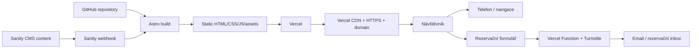

# Infrastructure: Starobrněnský Šenk

**Verze:** 1.0  
**Stav:** doporučená produkční architektura  
**Source of truth:** [PRD.md](./PRD.md) a [design.md](./design.md)  
**Rozsah:** homepage, obědové menu, animace, rezervace, kontakt a budoucí jídelní/nápojový lístek

## 1. Krátké rozhodnutí

Ano — samotný web může běžet jako HTML, CSS, vanilla JavaScript a GSAP. Pro produkční tvorbu ale doporučuji použít Astro jako build-time vrstvu:

```text
Astro + HTML/CSS + vanilla JS + GSAP ScrollTrigger
                    ↓ build
         statické HTML/CSS/JS/assets
                    ↓ deploy
                  Vercel/CDN
```

To znamená:

- žádný React, Next.js, Vue runtime ani SPA router,
- žádný aplikační server pro běžné zobrazení webu,
- většina stránky se odešle jako hotové HTML,
- JavaScript se načte jen tam, kde je potřeba interakce,
- GSAP se použije pro scroll-driven typografii, parallax, masked transitions a rumovou horizontal scroll sekci,
- menu a další spravovaný obsah se aktualizují přes Sanity CMS, ale návštěvník stále dostane předgenerovanou statickou stránku.

Astro je vhodné pro obsahové weby, protože používá server-first přístup a ve výchozím nastavení neposílá návštěvníkům zbytečný JavaScript; jeho islands architektura umožňuje načítat interaktivní části odděleně. [Astro – Why Astro](https://docs.astro.build/en/concepts/why-astro/) a [Astro – Islands](https://docs.astro.build/en/concepts/islands/)

## 2. Doporučený stack

| Vrstva | Doporučení | Důvod |
|---|---|---|
| Build framework | Astro, static output | rychlé HTML, SEO, žádný globální JS runtime |
| Jazyk | TypeScript pro interakce; HTML/CSS pro markup a styling | méně chyb v motion a formulářích; žádný frontend framework |
| Styling | moderní CSS, CSS custom properties, CSS modules nebo scoped Astro styles | malé bundle, snadné tokeny z `design.md` |
| Motion | GSAP + ScrollTrigger; CSS transitions pro mikrointerakce | přesné scroll timelines, pinning, parallax a horizontal scroll |
| Typografie | self-hosted Caudex + Manrope, WOFF2 | žádný render-blocking externí font request, konzistentní diakritika |
| Obrázky | Astro Assets, AVIF/WebP, `srcset`, lazy loading | menší payload, správné rozměry a stabilnější layout |
| Content | Sanity CMS + Astro build-time integration | validovaný obsah, snadná aktualizace bez runtime CMS |
| Hosting | Vercel | globální edge distribuce, HTTPS, preview deploye a serverless funkce |
| DNS | stávající registrátor nebo Vercel DNS | jednoduché napojení domény a správa redirectů |
| Rezervace | primárně `tel:`; volitelně Vercel Function + Turnstile | minimum infrastruktury a ochrana formuláře proti spamu |
| Analytics | Vercel Web Analytics nebo Plausible | lehčí a privacy-first měření |
| Monitoring | Vercel monitoring + uptime check + Lighthouse CI | rychlá kontrola dostupnosti a regresí |

## 3. Proč ne čisté ruční HTML jako finální řešení

Čisté HTML/CSS/JS + GSAP je úplně dostačující pro prototyp nebo malý web s občasnou ruční aktualizací. Pro Starobrněnský Šenk má ale Astro několik praktických výhod:

- homepage, jídelní lístek a nápojový lístek mohou sdílet layout, metadata a komponenty,
- obědové menu může mít validovaný formát pro dny, ceny a alergeny,
- obrázky lze optimalizovat při buildu,
- navigace a SEO metadata nebudou ručně duplikovaná v několika HTML souborech,
- preview deploy umožní zkontrolovat změny před zveřejněním,
- výsledek je stále statický a lehký.

Čisté ruční HTML bych zvolil pouze v případě, že:

- menu bude aktualizovat výhradně vývojář,
- nebude potřeba CMS,
- web zůstane velmi malý,
- akceptuje se ruční kontrola všech stránek a URL.

Pro produkci doporučuji Astro, ale psát ho jako „HTML-first“ projekt bez frontend frameworku.

## 4. Navržená architektura



### Runtime model

Běžná návštěva nevolá databázi ani server-rendering. Vercel servíruje hotové statické soubory z edge sítě. Dynamický backend existuje pouze pro rezervaci, pokud se vůbec bude používat online formulář.

Tento model snižuje:

- počet míst, která lze napadnout,
- množství JavaScriptu v prohlížeči,
- TTFB a závislost na runtime serveru,
- provozní náklady,
- riziko, že chyba CMS shodí celý web.

## 5. Projektová struktura

Doporučená struktura:

```text
starobrněnský-senk/
├─ public/
│  ├─ fonts/
│  ├─ images/
│  ├─ favicon.svg
│  ├─ robots.txt
│  ├─ sitemap.xml
│  └─ vercel.json
├─ src/
│  ├─ components/
│  │  ├─ Header.astro
│  │  ├─ LunchMenu.astro
│  │  ├─ RumRail.astro
│  │  ├─ Gallery.astro
│  │  ├─ ReservationForm.astro
│  │  └─ MapLink.astro
│  ├─ content/
│  │  ├─ config.ts
│  │  ├─ menu/
│  │  └─ rums/
│  ├─ layouts/
│  │  └─ BaseLayout.astro
│  ├─ pages/
│  │  ├─ index.astro
│  │  ├─ jidelnilistek.astro
│  │  └─ napojovylistek.astro
│  ├─ scripts/
│  │  ├─ motion.ts
│  │  ├─ hero-motion.ts
│  │  └─ rum-rail.ts
│  └─ styles/
│     ├─ tokens.css
│     ├─ global.css
│     └─ motion.css
├─ tests/
├─ astro.config.mjs
├─ package.json
├─ pnpm-lock.yaml
├─ tsconfig.json
└─ README.md
```

Poznámka: samostatné stránky `jidelnilistek.astro` a `napojovylistek.astro` jsou připravené jako budoucí rozsah. V této fázi se nemají tvořit ani publikovat.

## 6. Obědové menu a obsah

Obědové menu je nejdůležitější provozní obsah webu, proto musí mít jednodušší a spolehlivější aktualizaci než zbytek homepage.

### Produkční model: Sanity CMS jako headless CMS

Sanity CMS bude zdrojem pravdy pro obědové menu a další obsah, který má provoz pravidelně upravovat. Web si obsah stáhne při buildu a následně publikuje statickou verzi. Sanity nebude součástí návštěvnického runtime.

```text
Majitel upraví menu v CMS
        ↓
CMS webhook
        ↓
Vercel build/deploy
        ↓
nová statická homepage
```

Výhody:

- návštěvník nikdy nepotřebuje JavaScript CMS klienta,
- změny menu jsou verzované a kontrolovatelné,
- na web se nedává tajný CMS token,
- menu zůstane dostupné i při krátkém výpadku CMS,
- struktura může vynutit den, datum, polévku, jídla, ceny a alergeny.

### Záložní obsah

Build musí zachovat poslední úspěšně vygenerovanou verzi webu, pokud Sanity API nebo webhook dočasně selže. Lokální JSON/Markdown soubory mohou existovat pouze jako vývojový fallback nebo seed data; nesmí vzniknout druhý ručně spravovaný source of truth.

### Kritické pravidlo aktuálnosti

Menu nesmí být zveřejněno bez data a času poslední aktualizace. Pokud se obsah nepodaří načíst při buildu, build má selhat nebo zachovat poslední validní menu — nikdy nezobrazit prázdnou sekci.

## 7. GSAP a JavaScript strategie

### Ano pro GSAP

GSAP je vhodný pro:

- scroll-triggered typografii,
- masked image reveals,
- parallax fotografií,
- přechody barevných kapitol,
- pinned horizontal rail rumů,
- přesné timeline a progress řízení.

GSAP ScrollTrigger zpracovává pozice předem, reaguje na scroll přes `requestAnimationFrame` a podporuje horizontal/container animation scénáře. [GSAP ScrollTrigger documentation](https://gsap.com/docs/v3/Plugins/ScrollTrigger/)

### Co má zůstat bez GSAP

- hover a focus barvy,
- underline animace,
- tlačítko a tap feedback,
- běžné fade-in efekty bez scrub timeline,
- menu open/close, pokud stačí CSS,
- reduced-motion fallback.

### Co nedoporučuji

- React jen kvůli animacím,
- Three.js/WebGL na celé homepage,
- globální SPA stav,
- custom cursor na mobilu,
- scroll-jacking celé stránky,
- nekonečné marquee texty, které zhoršují čtení,
- více scroll knihoven současně.

### Loading strategie

- GSAP core a ScrollTrigger načíst jako jediný motion bundle.
- Hero motion může být priorita, ale bez něj musí být HTML viditelné.
- Galerie a rum rail inicializovat až při přiblížení k viewportu.
- Pokud animace není potřebná na konkrétní stránce, její script se na stránku vůbec nepřibalí.
- Používat `gsap.context()` nebo ekvivalentní cleanup při destrukci/změně stránky.
- Každý ScrollTrigger vytvořit až po načtení fontů a rozměrů obrázků; po dynamické změně volat refresh.

### Reduced motion

`prefers-reduced-motion: reduce` musí:

- vypnout parallax,
- vypnout pinning rumové sekce,
- změnit masked reveals na okamžité odhalení,
- vypnout stagger typografie,
- zachovat nativní horizontální carousel nebo vertikální seznam rumů,
- ponechat všechny texty, ceny, CTA a formuláře dostupné.

## 8. Hosting a deployment

### Doporučení: Vercel

Vercel je vhodný pro statický Astro output: Astro lze na Vercel deployovat bez speciální konfigurace, Git integrace vytváří preview URL pro pull requesty a Vercel podporuje také serverless routes pro případný rezervační formulář. [Astro on Vercel](https://vercel.com/docs/frameworks/frontend/astro) a [Vercel deployments](https://vercel.com/docs/deployments/overview)

### Deployment flow

1. Vývoj probíhá v GitHub repository.
2. Pull request vytvoří preview deployment.
3. Po schválení merge do `main` spustí Vercel production build.
4. Vercel publikuje statický build output.
5. Produkční doména vždy ukazuje na poslední úspěšný deployment.
6. Při problému se provede rollback na předchozí deployment.

### Doména

- Doménu `starobrnenskysenk.cz` připojit ve Vercel Project → Settings → Domains.
- DNS záznamy mohou zůstat u současného registrátora; nastaví se přesně podle instrukcí, které Vercel pro doménu zobrazí.
- Zvolit jednu kanonickou variantu: doporučeně `https://starobrnenskysenk.cz`.
- `https://www.starobrnenskysenk.cz` přesměrovat 301 na kanonickou variantu, nebo opačně, pokud se majitel rozhodne zachovat `www`.
- HTTP přesměrovat na HTTPS.
- Staré URL z původního webu zachovat přes 301 redirecty, pokud mají návštěvnost nebo odkazy.
- Preview domény označit `noindex`, aby se neindexovaly ve vyhledávačích. V Astro lze `robots` metadata řídit podle Vercel environmentu (`VERCEL_ENV`).

### Sanity → Vercel deploy hook

Sanity webhook má být nastavený na Vercel Deploy Hook a filtrovaný pouze na publikaci relevantního obsahu. Vercel Deploy Hook je unikátní URL, která spouští build bez nového commitu; URL se musí chovat jako tajný credential. [Vercel Deploy Hooks](https://vercel.com/docs/deploy-hooks) a [Sanity Webhooks](https://www.sanity.io/docs/http-reference/webhooks)

```text
Sanity publish
      ↓
Sanity document webhook
      ↓ POST
Vercel Deploy Hook
      ↓
Astro build se Sanity daty
      ↓
Production deployment
```

## 9. Security baseline

Nejbezpečnější varianta je taková, která nemá server ani databázi pro běžné návštěvy. Pokud bude existovat rezervační endpoint, je oddělený od statického webu.

### HTTP headers

Do kořenového `vercel.json` přidat minimálně:

```json
{
  "headers": [
    {
      "source": "/(.*)",
      "headers": [
        { "key": "Strict-Transport-Security", "value": "max-age=31536000" },
        { "key": "X-Content-Type-Options", "value": "nosniff" },
        { "key": "X-Frame-Options", "value": "DENY" },
        { "key": "Referrer-Policy", "value": "strict-origin-when-cross-origin" },
        { "key": "Permissions-Policy", "value": "camera=(), microphone=(), geolocation=(), payment=()" },
        { "key": "Content-Security-Policy", "value": "default-src 'self'; base-uri 'self'; object-src 'none'; frame-ancestors 'none'; form-action 'self'; img-src 'self' data: https:; font-src 'self'; style-src 'self'; script-src 'self'; connect-src 'self'" }
      ]
    }
  ]
}
```

Před nasazením CSP je nutné zkontrolovat všechny skutečné zdroje. Pokud se použije Turnstile, Sanity image CDN nebo externí analytics, příslušné domény se přidají pouze do konkrétních direktiv. Nezačínat plošným `unsafe-eval` nebo `unsafe-inline` bez konkrétního důvodu. Vercel umožňuje bezpečnostní headers konfigurovat přes `vercel.json`.

HSTS zapnout až po ověření, že všechny subdomény, redirecty a assety fungují přes HTTPS. CSP nejprve testovat přes `Content-Security-Policy-Report-Only`, potom teprve vynutit. [MDN – CSP implementation guide](https://developer.mozilla.org/en-US/docs/Web/Security/Practical_implementation_guides/CSP) a [MDN – HSTS](https://developer.mozilla.org/en-US/docs/Web/HTTP/Reference/Headers/Strict-Transport-Security)

### Dependency security

- Používat `pnpm-lock.yaml` a přesné verze balíčků.
- Dependabot nebo Renovate pro aktualizace.
- Aktualizovat Astro, GSAP a build tooling pravidelně.
- V CI spouštět `pnpm audit --prod` a kontrolu lockfile.
- Neinstalovat knihovnu jen kvůli jednomu efektu.
- Nepoužívat tajné tokeny v `PUBLIC_*` proměnných, pokud skutečně nemají být veřejné.
- Sanity read token, webhook secret, email API keys a Turnstile secret držet pouze ve Vercel/GitHub environment secrets.
- Nepouštět HTML z CMS přes `set:html` bez sanitizace a důvěryhodného schema.

## 10. Rezervace a formulář

### Fáze 1: telefon jako primární cesta

Podle PRD je telefonická rezervace nejjednodušší a nejrobustnější varianta:

- `tel:` CTA funguje bez backendu,
- neukládají se osobní údaje,
- nevzniká spam endpoint,
- návštěvník dostane okamžité potvrzení od obsluhy.

### Fáze 2: online formulář pouze pokud ho majitel opravdu potřebuje

Doporučený tok:

```text
HTML form
  ↓
Cloudflare Turnstile token
  ↓
Vercel Function
  ↓
server-side Siteverify
  ↓
validace + rate limit
  ↓
email do rezervačního inboxu
```

Turnstile token se musí ověřovat server-side přes Siteverify; samotné vložení widgetu do HTML nestačí. Tajný klíč nesmí být v client-side JavaScriptu. [Cloudflare Turnstile](https://developers.cloudflare.com/turnstile/) a [Turnstile – server-side validation](https://developers.cloudflare.com/turnstile/get-started/)

Formulář má sbírat pouze minimum údajů:

- jméno,
- telefon nebo email,
- datum a čas,
- počet osob,
- nepovinná poznámka.

Worker musí:

- validovat a normalizovat vstupy,
- odmítnout nadměrně dlouhé hodnoty,
- ověřit Turnstile,
- použít rate limiting nebo honeypot,
- nevracet detailní interní chyby do prohlížeče,
- logovat pouze technické údaje nutné pro diagnostiku,
- neposílat osobní údaje do analytiky.

Pokud majitel nemá kapacitu potvrzovat online rezervace, formulář se nemá vytvářet. Neaktuální nebo neobsluhovaný formulář je horší než viditelný telefon.

## 11. Obrázky, video a asset pipeline

- Zdrojové fotografie nikdy neposílat v originální velikosti.
- Pro hero připravit AVIF/WebP s poster fallbackem.
- Použít `width`, `height` nebo aspect-ratio, aby nevznikal CLS.
- Hero image preloadovat pouze jednu skutečně prioritní fotografii.
- Galerie a rumy lazy-loadovat.
- Používat `srcset` a `sizes` podle breakpointů.
- Dekorativní video bez zvuku nesmí blokovat první paint.
- Video má mít poster, `playsinline`, `muted`, `loop` a fallback na obrázek.
- Galerie má být dostupná i při vypnutém JavaScriptu.
- Assety pojmenovat podle obsahu, ne podle exportního názvu z Figmy.

## 12. Analytics a monitoring

### Co měřit

- zobrazení obědového menu,
- kliknutí na telefon,
- kliknutí na navigaci,
- kliknutí na rezervaci,
- otevření jídelního nebo nápojového lístku,
- použití rum railu a galerie pouze jako sekundární UX signál.

### Doporučení

- Začít Vercel Web Analytics nebo Plausible.
- Nepřidávat Google Analytics, Meta Pixel ani heatmapu bez jasného důvodu a vyřešeného consent modelu.
- Nikdy neměřit obsah poznámky z rezervačního formuláře.
- Nastavit uptime monitor na produkční doménu.
- Po každém deployi spustit Lighthouse CI na mobile i desktop.
- V CI kontrolovat broken links, sitemap, SEO metadata, kontrast a JS bundle size.

## 13. Performance budget

Orientační budget pro homepage:

| Oblast | Cíl |
|---|---:|
| první HTML dokument | do 50 kB komprimovaně, bez obrázků |
| kritické CSS | do 30 kB komprimovaně |
| initial JS | ideálně do 80 kB komprimovaně |
| GSAP + ScrollTrigger | načítat pouze v motion bundle; měřit reálnou velikost |
| hero image | přibližně do 250–350 kB podle rozlišení a formátu |
| obrázek pod foldem | lazy-load a responzivní varianty |
| fonty | pouze používané řezy, ideálně 2 rodiny / 4–5 řezů celkem |
| Core Web Vitals | zelené hodnoty na mobile i desktop |

Budget je kontrolní nástroj, ne absolutní dogma. Pokud hero fotografie překročí limit, musí mít jasný důvod a test na reálném mobilním připojení.

## 14. Development workflow

### Lokální vývoj

- Node.js Active LTS, verze připnutá v `.nvmrc` nebo `mise.toml`.
- `pnpm` jako package manager.
- `pnpm dev` pro lokální server.
- `pnpm build` musí proběhnout bez warningů, které by ovlivnily obsah.
- `pnpm preview` pro kontrolu produkčního buildu.
- `pnpm lint`, `pnpm typecheck`, `pnpm test` před merge.

### Git workflow

- `main` = produkce.
- krátké feature branche.
- pull request = automatická kontrola + Vercel preview.
- žádné přímé editace na produkci.
- každý obsahový deploy má dohledatelný commit nebo CMS revision.

### Aktualizace menu

- CMS webhook automaticky spustí build.
- Build validuje schéma, datum, ceny a povinné položky.
- Pokud validace selže, nová verze se nepublikuje.
- Obsluha má jednoduchý návod: vybrat den, zadat jídla, ceny, alergeny, publikovat.

## 15. Co nedoporučuji jako první verzi

- WordPress s desítkami pluginů a page builderem.
- Next.js nebo React SPA jen kvůli homepage animacím.
- Databáze a vlastní backend pro statické sekce.
- Google Maps JavaScript SDK; stačí mapa jako odkaz nebo lazy iframe podle potřeby.
- Externí fonty načítané bez kontroly a bez subsetu.
- Automaticky se přehrávající velké video přes celý web.
- Cookie-heavy analytický stack bez jasného business cíle.
- Rezervační formulář bez spolehlivého inboxu a potvrzovacího procesu.
- Smooth-scroll knihovnu, která převezme kontrolu nad celým scrollováním.

## 16. Doporučené fáze

### Fáze 1: základ

- Astro projekt a statický build.
- Homepage podle `design.md`.
- Sanity schema a první obsah obědového menu.
- Telefon, navigace a otevírací doba.
- GSAP hero, reveal, parallax a rum rail.
- Vercel, vlastní doména, HTTPS, `vercel.json` headers.

### Fáze 2: provozní pohodlí

- Sanity CMS jako hlavní obsahový zdroj pro obědové menu a další provozní obsah.
- Sanity webhook na Vercel Deploy Hook.
- Preview a publikace obsahu.
- Uptime monitor, analytics a Lighthouse CI.

### Fáze 3: rezervace a další stránky

- online rezervační formulář pouze po potvrzení provozního procesu,
- Vercel Function + Turnstile + email delivery,
- samostatná stránka jídelního lístku,
- samostatná stránka nápojového lístku.

## 17. Finální doporučení

Pro tento projekt bych zvolil:

```text
Astro static site
+ vanilla HTML/CSS/TypeScript
+ self-hosted Caudex + Manrope
+ GSAP + ScrollTrigger pro vybrané motion sekce
+ CSS pro mikrointerakce
+ Sanity CMS jako source of truth pro menu a spravovaný obsah
+ GitHub pro verzování a review
+ Vercel + DNS + HTTPS + headers
+ telefon jako primární rezervace
+ Vercel Function + Turnstile pouze pro případný formulář
```

Čistý HTML/CSS/JavaScript/GSAP runtime je tedy správný směr. Astro pouze zlepší tvorbu, SEO, obrázky, validaci obsahu a budoucí rozšíření webu, aniž by návštěvníkovi posílal těžký frontend framework.

## 18. Reference dokumentace

- [Astro – Why Astro](https://docs.astro.build/en/concepts/why-astro/)
- [Astro – Islands architecture](https://docs.astro.build/en/concepts/islands/)
- [Astro – project structure and assets](https://docs.astro.build/en/basics/project-structure/)
- [GSAP – ScrollTrigger](https://gsap.com/docs/v3/Plugins/ScrollTrigger/)
- [Astro on Vercel](https://vercel.com/docs/frameworks/frontend/astro)
- [Vercel deployments](https://vercel.com/docs/deployments/overview)
- [Vercel Deploy Hooks](https://vercel.com/docs/deploy-hooks)
- [Cloudflare Turnstile](https://developers.cloudflare.com/turnstile/)
- [MDN – Content Security Policy](https://developer.mozilla.org/en-US/docs/Web/HTTP/Reference/Headers/Content-Security-Policy)
- [MDN – Strict-Transport-Security](https://developer.mozilla.org/en-US/docs/Web/HTTP/Reference/Headers/Strict-Transport-Security)
